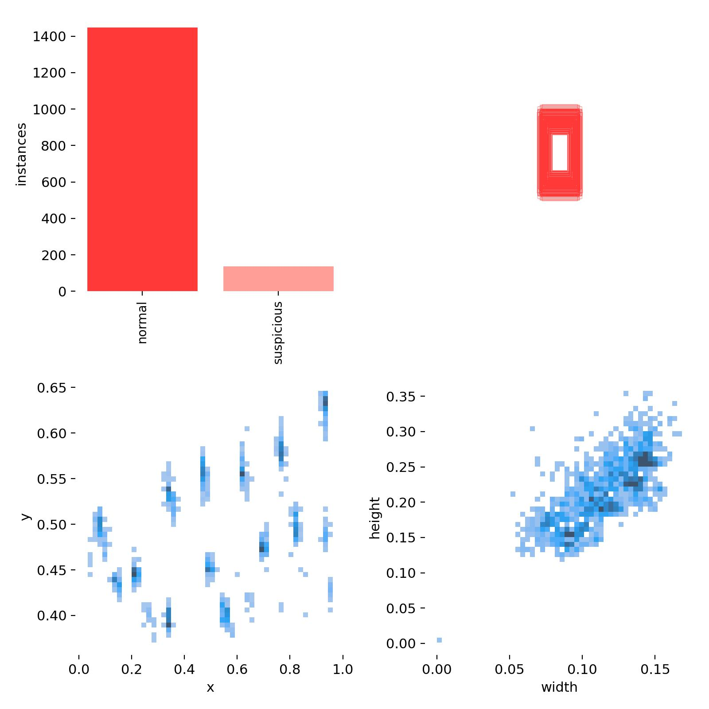
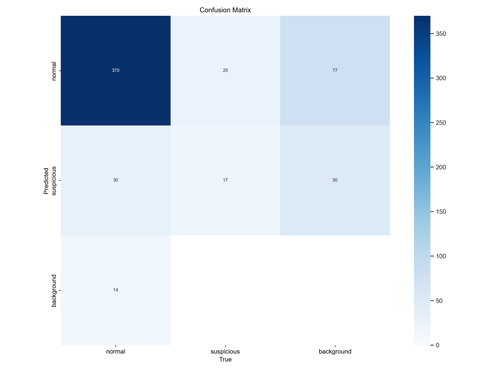
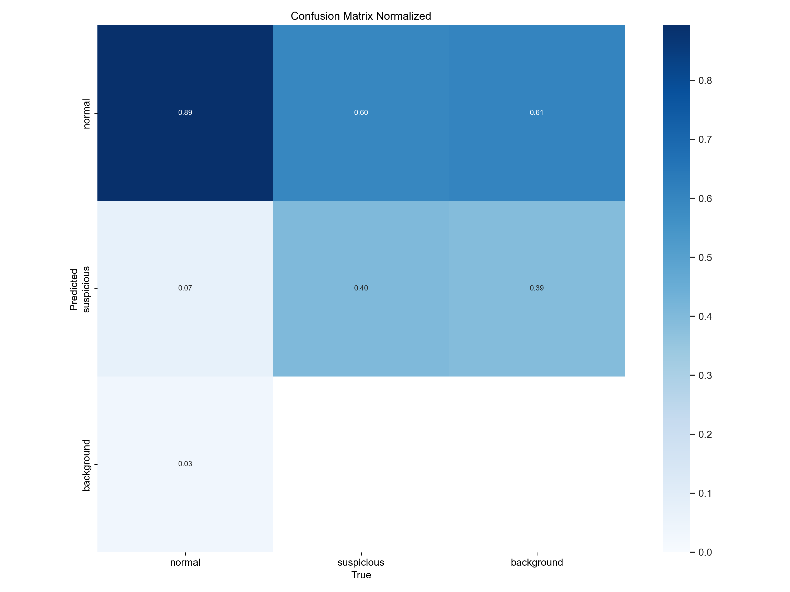
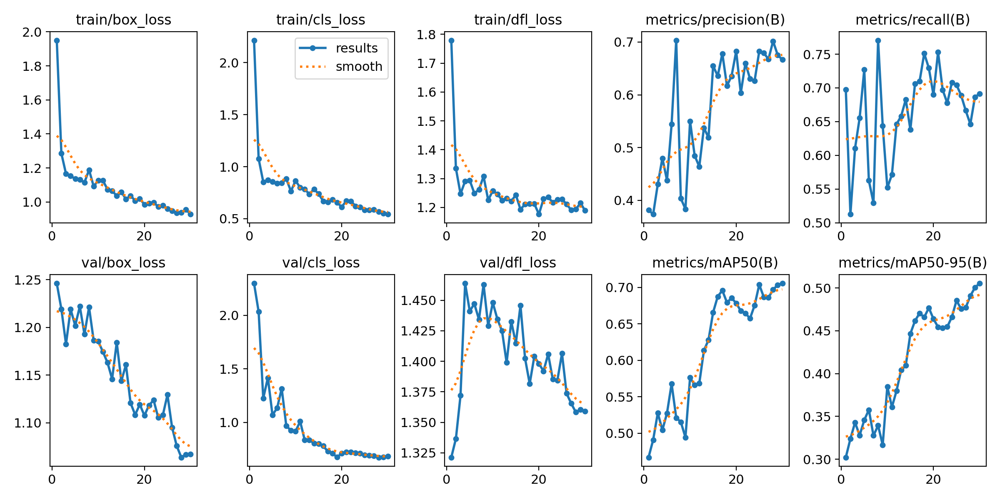

# 7th Traning Recap

| Data       | Values           |
| ---------- | ---------------- |
| Date       | 2024-02-28       |
| Model      | YOLOv8m          |
| Dataset    | ESC: Right Angle |
| Epochs     | 30               |
| Batch Size | 8                |

## Data Labels Summary

## Confusion Matrix (BY YOLO TRAIN)

## Normalized Confusion Matrix (BY YOLO TRAIN)

## F1 Curve

Dari gambar di atas dapat dilihat bahwa F1 score stabil pada confident score 0.6 kebawah. Namun terjadi penurunan yang signifikan pada confident score 0.6 keatas.

## Precision-Confidence Curve

Dari gambar di atas dapat dilihat bahwa kenaikan nilai precision berbanding lurus dengan kenaikan confident score.

## Recall-Confidence Curve

Dari gambar di atas dapat dilihat bahwa kenaikan nilai recall berbanding terbalik dengan kenaikan confident score.

## Precision-Recall Curve

## Traning Result

Dari gambar di atas dapat dilihat bahwa pada `train/box_loss`, `train/obj_loss`, dan `train/cls_loss` memiliki tren yang menurun mendekati 0 namun belum stabil. Sedangkan pada `val/box_loss`, `val/obj_loss`, dan `val/cls_loss` sudah mendekati 0 dan memiliki tren yang stabil.

## Conclusion

- Sebaran class pada dataset tidak seimbang (imbalance dataset).
- Nilai F1 score stabil pada confident score 0.6 kebawah.
- Nilai precision berbanding lurus dengan kenaikan confident score.
- Nilai recall berbanding terbalik dengan kenaikan confident score.
- Tren pada `train/box_loss`, `train/obj_loss`, dan `train/cls_loss` mendekati 0 namun belum stabil.

## Next Steps

- Dikarenakan terjadi imbalance dataset, dan kasus False Negative lebih berbahaya daripada False Positive, maka recall akan menjadi ukuran yang lebih diperhatikan.
- Mencoba untuk meningkatkan recall dengan menambah jumlah data pada dataset.
- Meningkatkan jumlah epoch untuk melihat perubahan tren pada `train/box_loss`, `train/obj_loss`, dan `train/cls_loss`.
